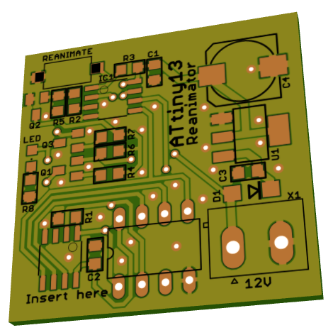

# Печатная плата реаниматора для ATtiny13

Плата разработана с помощью Eagle 6.6.

Для восстановления работоспособности заблокированной ATtiny13, её
следует вставить в колодку или прижать к контактам на плате (для SMD),
затем подать питание (12В) на плату. Восстановление микроконтроллёра
происходит при подаче питания и при нажатии кнопки Reanimate.

Устройство собрано по мотивам сайта [РадиоДЕД](http://radioded.ru/skhema-na-mikrokontrollere/reanimator-mikrokontrollerov-avr-attiny13).

